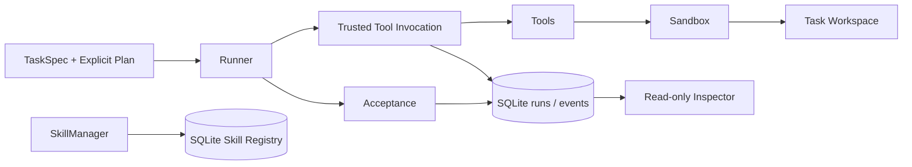

<p align="center">
  
</p>

# Axis-Evo

**面向大语言模型智能体的可信执行事实与不可变技能版本研究原型。**

Axis-Evo is a research prototype for durable agent execution facts, deterministic
acceptance, crash-state inspection, and immutable skill versioning.

本项目服务于《大语言模型智能体可信技能演化与中断恢复系统设计与实现》。它从执行证据出发，
记录“准备做什么、观察到什么、实际持久化了什么”，为后续技能使用、演化与中断恢复建立可审查的基础。

当前实现到 **Phase 2 / Step 1 — Skill Card + Immutable Version Registry + Lifecycle + Lineage**。
Phase 1 的执行、验收和 Inspector 已完成并冻结；Skill 版本基础已实现并通过测试，尚未接入 Runner。
运行时代码仅依赖 Python 标准库，要求 **Python 3.11+**；测试使用 pytest。

## 项目解决什么问题

智能体执行一次文件修改时，工具返回的 SUCCESS、文件当前内容和数据库中的执行记录，
可能在进程崩溃后留下不同的证据。Axis-Evo 将这些事实分别记录，避免把不完整的执行证据
误判为任务完成，或者把一次外部状态变化直接归因给工具。

项目围绕三个问题展开：

- **执行事实是否可靠？** 意图先提交、事件有序持久化，工具执行前后由 Core 记录文件观察。
- **任务是否真正完成？** 最终完成由独立的确定性 Acceptance 授权，而非模型声明或工具自报。
- **技能版本是否可追溯？** 每个 Skill 由稳定身份和整数版本定位，内容不可变，来源明确，生命周期历史只追加。

当前 Runner 执行调用方提供的显式计划，没有真实 LLM 决策循环。恢复、信任评估与技能自动演化属于后续研究范围。

## 已实现能力

| 模块 | 当前能力 |
| --- | --- |
| Foundation | 严格 TaskSpec JSON、Event Envelope v1、canonical JSON / SHA-256、SQLite 持久化、显式 PluginRegistry |
| Sandbox / Tools | seed-copy 工作区、路径边界、Core 文件观察，以及 read_file / write_file / patch_file / run_tests |
| Runner / Acceptance | 显式顺序计划、执行事实编排、文件断言、独立 pytest 验收、原子终态提交 |
| Inspector | 只读执行轨迹检查、invocation 闭合一致性检查、未结束运行和缺失结果识别、外部状态比较 |
| Skill Registry | Skill Card v1、不可变 SkillRef、连续版本分配、来源验证、追加式生命周期、读取完整性校验 |

Sandbox 提供工作区路径约束和文件观察；当前没有容器或操作系统级进程隔离。
`run_tests` 是受限 pytest 子进程入口，PluginRegistry 只负责显式注册和检索。

## 核心工程契约

### 1. 执行事实先于外部副作用

SQLite 连接使用 `foreign_keys=ON`、`journal_mode=WAL`、`synchronous=FULL` 和
`busy_timeout=5000`。事件的 run-local `seq` 在 `BEGIN IMMEDIATE` 内分配，`append_event()`
只有在 COMMIT 成功后才返回；失败回滚。时间戳是审计元数据，事件顺序以 `seq` 为准。

变更型工具的正常执行路径为：

```text
PRE observation
→ FILE_OBSERVED(reason=PRE_TOOL)
→ TOOL_INTENT COMMIT
→ tool.execute
→ POST observation
→ FILE_OBSERVED(reason=POST_TOOL)
→ TOOL_RESULT
→ optional STEP_CONFIRMED
```

工具的外部执行位于 SQLite transaction 之外。SQLite 与文件系统没有被包装为一个原子事务，
因此保留了意图提交后、结果提交前可能发生中断的 **Crash Window B**。

执行前必须验证 run/workspace 绑定和 invocation ID。一个 run 内的 `tool_call_id` 只能标识一次调用尝试；
Runner 预先提交的、完全匹配的单条 STEP_PLANNED 是唯一兼容前缀。

### 2. 完整结果证据与任务成功分别判断

`STEP_CONFIRMED` 表示该 invocation 已有完整持久化结果证据，**不表示步骤成功**。
FAILED ToolResult 仍可被确认，随后 Runner 正常终止为 RUN_FAILED。

`RUN_COMPLETED` 必须由 `VALIDATION_PASSED` 支持。工具 SUCCESS、模型声明完成，
甚至计划中主动调用 `run_tests` 通过，都不能替代最终 Acceptance。
终态 Event 与 `runs.status / ended_at` 在同一次 SQLite transaction 内原子提交。

文件断言支持 `exists`、`not_exists`、`contains`、`equals`。验收路径在计划执行前通过现有路径解析边界预检；
文本断言读取的原始字节必须与已记录 FileObservation 的 SHA-256 和大小一致，随后严格 UTF-8 解码，
不归一化换行。观察后内容发生变化会导致断言失败。

### 3. 崩溃后保留证据边界

硬退出可能留下 `RUNNING`、`ended_at=NULL` 和不完整事件前缀，不能自动补成 INTERRUPTED。
Inspector 依据实际记录报告：

| 观察 | 含义 |
| --- | --- |
| `UNFINISHED_RUN` | 持久化运行事实仍未结束 |
| `EXECUTION_RESULT_UNKNOWN` | invocation 已有 TOOL_INTENT，但缺少 TOOL_RESULT |
| `EXTERNAL_STATE_CHANGED` | 当前文件状态与已记录的执行前观察不同 |

文件变化不证明工具执行过；文件相同也不证明工具没有执行。Inspector 不重建缺失 ToolResult，
不执行恢复，也不修改 runs/events/schema 或任务工作区。
它通过 `mode=ro` 读取包括已提交 WAL 在内的事实，允许 SQLite 内部 WAL/SHM 协调 sidecar，
不使用可能漏读已提交 WAL 的 `immutable=1`。

### 4. Skill 内容不可变，生命周期只追加

Skill 使用以下身份定位一个不可变版本：

```text
SkillRef = skill_id + skill_version
```

- `skill_id` 严格匹配 `[A-Za-z0-9][A-Za-z0-9._-]{0,127}`；`skill_version` 是正整数，bool 不算 int。
- 版本从 1 开始，在 `BEGIN IMMEDIATE` 内连续分配；失败不占版本号。
- 首版可 MANUAL，或 DERIVED 自已存在的其他 Skill 版本；后续版本必须 DERIVED。
- 支持跨 Skill 派生；来源必须预先存在，不能形成正常创建路径上的自指、未来引用或循环。
- 所有新版本从 CANDIDATE 开始，只能显式晋升 `CANDIDATE → SHADOW → TRUSTED`。
- 来源版本的 TRUSTED 状态不会继承给新版本；晋升不会改变 Card、hash 或来源。

Skill Card v1 只包含八个明确字段，生命周期不写入 Card：

```json
{
  "schema_version": 1,
  "skill_id": "config.timeout",
  "skill_version": 1,
  "name": "Update timeout",
  "description": "A recorded procedure for changing a timeout setting",
  "instructions": "Read the configuration, patch the value, then validate it.",
  "allowed_tools": ["read_file", "patch_file", "run_tests"],
  "source": {"kind": "MANUAL"}
}
```

DERIVED source 的固定形状为 `{"kind":"DERIVED","skill_id":"config.timeout","skill_version":1}`。
Card 使用现有 canonical JSON 字节计算 SHA-256；SQLite 触发器阻止既有身份、版本和历史行的修改/删除。
读取核对规范字节、hash、身份、来源、连续版本及生命周期历史；不一致抛出 `SkillIntegrityError`，不静默修复。

`TRUSTED` 当前只是显式生命周期状态，没有证据评分或 Trust Evaluator。
Card instructions 仅作为数据保存；当前任务执行不会消费 Skill。

## 架构与目录



Skill Registry 目前是独立的版本基础，不与 Runner 建立执行绑定。

```text
src/axis_evo/
├── models.py                 # Task / Run / PlanStep / result / observation
├── events.py                 # Event Envelope 与事件类型
├── hashing.py                # canonical JSON 与 SHA-256
├── task_spec.py              # 严格 TaskSpec JSON 加载
├── storage.py                # SQLite 连接、事件与原子终态
├── plugins.py                # 最薄显式注册表
├── sandbox.py                # 路径解析、seed-copy、文件观察
├── tools.py                  # 文件工具、pytest 工具、可信调用入口
├── runner.py                 # 显式计划顺序执行
├── validators.py             # 独立确定性验收
├── inspector.py              # 只读检查与 CLI
├── skill_card.py             # SkillRef / SkillSource / SkillCard
├── skill_storage.py          # 显式 Skill schema 初始化
├── skill_manager.py          # 版本、来源、生命周期与完整性读取
└── migrations/
    ├── 001_phase1.sql        # runs / events
    └── 002_phase2_skills.sql # skills / skill_versions / skill_state_events

tests/
├── unit/                    # 协议、路径、工具、Inspector、Skill Card
├── integration/             # 存储、执行、Runner、崩溃、Skill Registry
└── fixtures/                # TaskSpec、seed 文件、硬退出子进程

docs/assets/Axis.png          # 项目封面原图
```

## 安装与测试

从仓库根目录操作。Windows PowerShell：

```powershell
git clone https://github.com/startuo/Axis-EVO.git
cd Axis-EVO
python -m venv .venv
.\.venv\Scripts\python -m pip install -e ".[test]"
.\.venv\Scripts\python -m pytest -q
```

Linux / macOS：

```bash
git clone https://github.com/startuo/Axis-EVO.git
cd Axis-EVO
python3 -m venv .venv
.venv/bin/python -m pip install -e ".[test]"
.venv/bin/python -m pytest -q
```

已有可用环境时，直接运行 `python -m pytest -q`。当前没有第三方运行时依赖，pytest 属于 test extra。

## 最小任务示例

在项目根目录使用已安装本包的 Python 运行以下代码。它使用仓库内真实 fixture：
复制 seed 到新工作区，把 timeout 从 10 改为 20，再执行文件断言和独立 pytest 验收。
每次生成新的工作区与 run；数据保存在 Git 忽略的 `.local/` 下。

```python
from pathlib import Path
from uuid import uuid4

from axis_evo.inspector import inspect_database
from axis_evo.models import PlanStep
from axis_evo.plugins import PluginRegistry
from axis_evo.runner import run_task
from axis_evo.storage import connect_database
from axis_evo.tools import PatchFileTool

state_dir = Path(".local").resolve()
state_dir.mkdir(exist_ok=True)
database = state_dir / "demo.sqlite3"
workspace = state_dir / f"workspace_{uuid4().hex}"
registry = PluginRegistry()
registry.register(PatchFileTool())

connection = connect_database(database)
try:
    run = run_task(
        connection,
        "tests/fixtures/tasks/demo_runner/task.json",
        workspace,
        [PlanStep("update_timeout", "patch_file", {
            "path": "config.json",
            "old": '"timeout": 10',
            "new": '"timeout": 20',
        })],
        registry,
    )
finally:
    connection.close()

report = inspect_database(database, run.run_id)
print("run_id:", run.run_id)
print("status:", run.status)
print("trace.consistent:", report["trace"]["consistent"])
```

正常输出中 `status` 为 `COMPLETED`，`trace.consistent` 为 `True`。
没有调用模型，`model_plugin` 使用默认的 `explicit_plan` 审计标签。

Inspector 也提供 CLI，下面的 `RUN_ID` 替换为运行输出的实际 ID：

```powershell
.\.venv\Scripts\python -m axis_evo.inspector .local/demo.sqlite3 RUN_ID
.\.venv\Scripts\python -m axis_evo.inspector .local/demo.sqlite3 RUN_ID --format json
```

## Skill Registry 示例

下面的独立示例在临时数据库中演示创建、晋升和派生，不执行 Skill：

```python
from pathlib import Path
from tempfile import TemporaryDirectory

from axis_evo.skill_card import SkillSource
from axis_evo.skill_manager import SkillManager
from axis_evo.skill_storage import initialize_skill_schema
from axis_evo.storage import connect_database

with TemporaryDirectory() as directory:
    connection = connect_database(Path(directory) / "skills.sqlite3")
    try:
        initialize_skill_schema(connection)
        manager = SkillManager(connection)
        first = manager.create_version(
            "config.timeout",
            name="Update timeout",
            description="A recorded configuration-edit procedure",
            instructions="Read, patch, then validate the configuration.",
            allowed_tools=["read_file", "patch_file", "run_tests"],
        )
        manager.promote(first.skill_id, first.skill_version, "SHADOW")
        manager.promote(first.skill_id, first.skill_version, "TRUSTED")
        second = manager.create_version(
            "config.timeout",
            name="Update timeout v2",
            description="A derived procedure",
            instructions="Inspect the value, patch it once, then validate.",
            allowed_tools=["read_file", "patch_file", "run_tests"],
            source=SkillSource("DERIVED", first.ref),
        )
        print(first.ref, manager.get_current_state(first.skill_id, 1))
        print(second.ref, manager.get_current_state(second.skill_id, 2))
    finally:
        connection.close()
```

输出分别为 v1 TRUSTED 和 v2 CANDIDATE。`connect_database()` 本身仍只初始化 Phase 1；
只有显式调用 `initialize_skill_schema()` 才增加三个 Skill 表。Manager 构造和读取不自动迁移。
写 API 拒绝已有调用方事务；调用方负责关闭连接。

完整公开方法为：`create_version()`、`get_version()`、`list_versions()`、
`get_current_state()`、`get_state_history()`、`promote()`。

## 验证记录与审查资料

当前 Windows / Python 3.12.10 的完整回归结果：

```text
python -m pytest -q
672 passed, 8 skipped in 25.52s
```

失败 0；pytest 未报告 warnings。8 个 skip 均为 Windows `WinError 1314` 符号链接权限限制，
具体 nodeid 与原因记录在交付报告中，不计作通过。

| Focused test | 结果 |
| --- | --- |
| `python -m pytest -q tests/unit/test_skill_card.py` | 95 passed |
| `python -m pytest -q tests/integration/test_skill_manager.py` | 98 passed |

测试使用真实生产代码、SQLite、并发连接和 subprocess hard exit，覆盖提交边界、Crash Window B、
路径约束、验收证据一致性、invocation 完整性、SQL 不可变性、真实 trigger / COMMIT 失败和 lineage 损坏。
进程硬退出测试验证已提交事实在进程退出后保留；没有声称验证断电或硬件故障。

阶段交付报告：

- [Phase 1 / Step 2 — Sandbox + Tools](STEP2_DELIVERY_REPORT.md)
- [Phase 1 / Step 4 — Inspector + Crash-State Detection](STEP4_DELIVERY_REPORT.md)
- [Phase 2 / Step 1 — Skill substrate](PHASE2_STEP1_DELIVERY_REPORT.md)

这些报告记录各自交付时的测试、文件和工作区状态；最新能力与使用说明以本 README 和当前源码为准。
Phase 2 Step 1 报告同时记录附件历史测试数量与真实旧文件库存的差异。
本地阶段审查 ZIP 保留为历史快照，不参与 Git 跟踪。

## 阶段状态与后续方向

| 阶段 | 状态 |
| --- | --- |
| Phase 1 / Step 1 — Foundation | 已完成、冻结 |
| Phase 1 / Step 2 — Sandbox + Tools + Core Observation | 已完成、冻结 |
| Phase 1 / Step 3 — Runner + Trace + Acceptance | 已完成、冻结 |
| Phase 1 / Step 4 — Inspector + Crash-State Detection | 已完成、冻结 |
| Phase 2 / Step 1 — Skill Card + Immutable Registry + Lifecycle + Lineage | 已实现、测试通过、审查包已交付 |
| Skill 与执行事实绑定、技能选择及演化 | 后续计划，尚未实现 |
| Trust Evaluator、Checkpoint、Recovery、真实 LLM Loop | 后续计划，尚未实现 |

当前版本没有自动技能应用、LLM 生成演化、trust score、故障归因、retry/resume/compensation 或 UI。
后续变更需要遵守已经冻结的执行证据和数据语义；新里程碑应独立实现、验证和审查。

项目维护：[startuo](https://github.com/startuo)。
